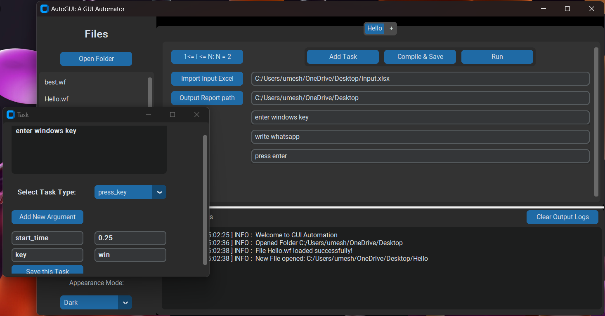

# AutoGUI: Automation Project

AutoGUI is a Python-based automation project developed using the **CustomTkinter** library for creating a graphical user interface (GUI). The project allows users to define and manage a stack of tasks that can be automatically executed on the system. It also integrates Excel for data manipulation, making it a versatile tool for automating repetitive tasks and managing data processing.

## Features

- Create and manage a stack of tasks to be executed automatically.
- Utilize the **CustomTkinter** GUI framework for an interactive user experience.
- Integrate Excel for seamless data manipulation and processing.
- Execute tasks automatically without manual intervention.
- Improve efficiency by automating repetitive tasks.

## Getting Started

### Installation

1. Clone this repository to your local machine:

   ```bash
   git clone https://github.com/Umesh-Kumar-01/AutoGUI.git
   ```
2. Navigate to the project directory:
    ```bash
   cd AutoGui
   ```
3. Install the required packages:
    ```bash
   pip install -r requirements.txt
   ```
### Usage
1. Run the main.py script:

    ```bash
    python main.py
    ```
2. The CustomTkinter GUI will open, allowing you to add, edit, and manage tasks in the stack.

3. Configure task details, such as automation commands, parameters, and data sources.

4. Use the Excel integration to manage and manipulate data for tasks.

5. If you want to use Excel variables in task arguments, follow these steps:

6. Create an Excel file containing an "Input" sheet.
   Add columns with variable names that you want to use as arguments in tasks (e.g., "Mobile Number").
   In the task argument, use the format <$Variable Name$> (e.g., <$Mobile Number$>).
   Once tasks are configured, click the "Run" button to initiate automatic execution. The workflow (stack of tasks) will run for the number of rows in the Excel file.

### Future Plans
- Create an efficient report system to generate task status reports in PDF/Excel formats.
- Implement delete buttons for widgets to allow easy removal of tasks.
- Enhance the UI with images and icons for a more visually appealing experience.
- Add a pause/resume functionality to tasks, providing greater control over task execution.
- Introduce the ability to import other AutoGUI (.wf) files, enabling task sharing and productivity gains.

### HomePage Image

### Contributing
Contributions to the AutoGui project are welcome! If you find any issues or have suggestions for improvements, please open an issue or submit a pull request on the project's GitHub repository.

### License
This project is licensed under the MIT License - see the LICENSE file for details.

### Acknowledgements
- The project was inspired by the need to automate repetitive tasks and streamline data manipulation processes.
- Special thanks to the CustomTkinter community for providing the GUI framework, and to the Tkinter and openpyxl communities for providing additional tools necessary to build this project.